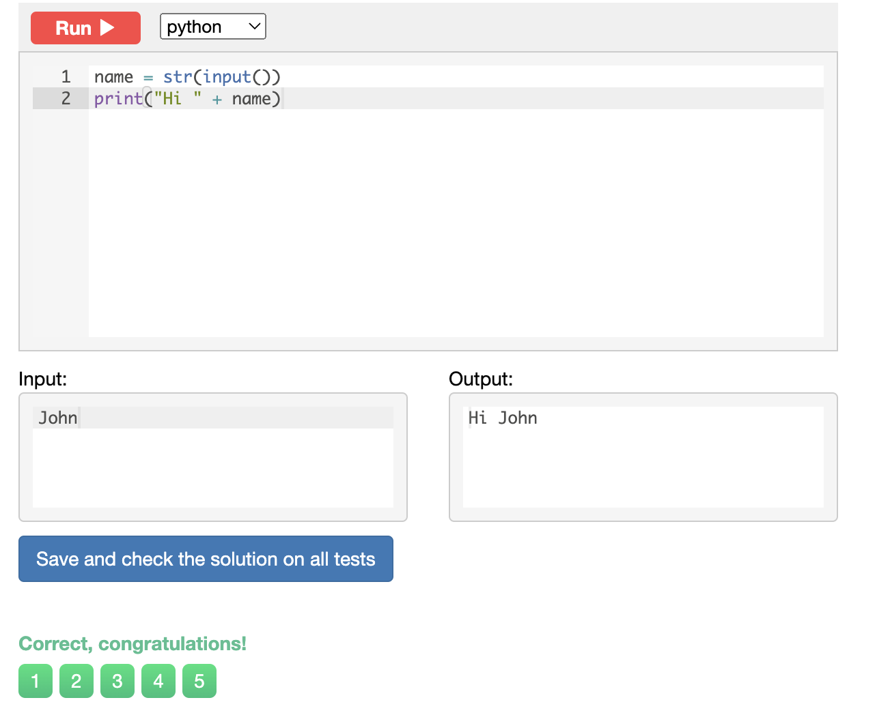
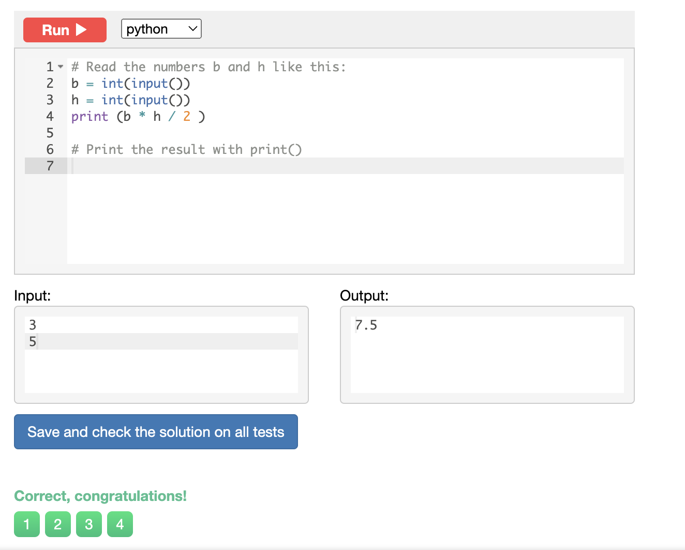
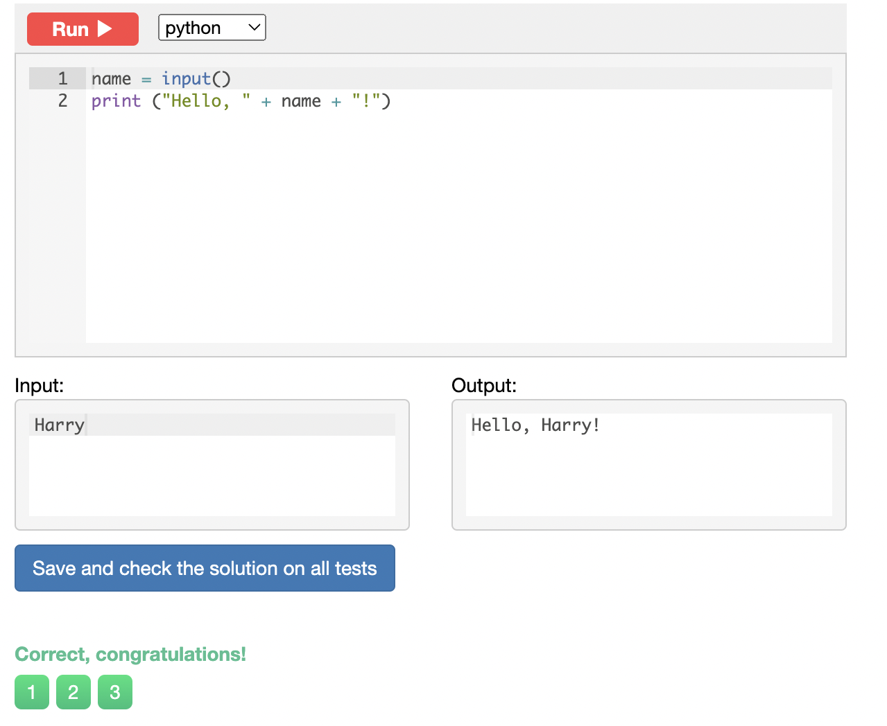
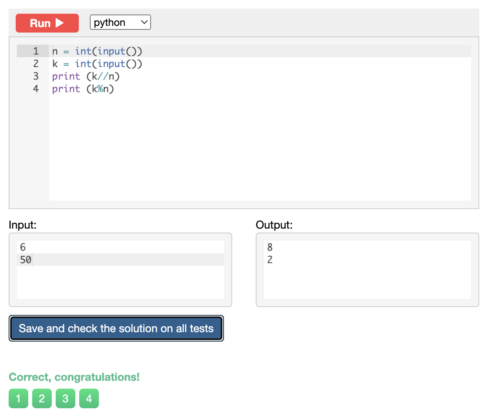
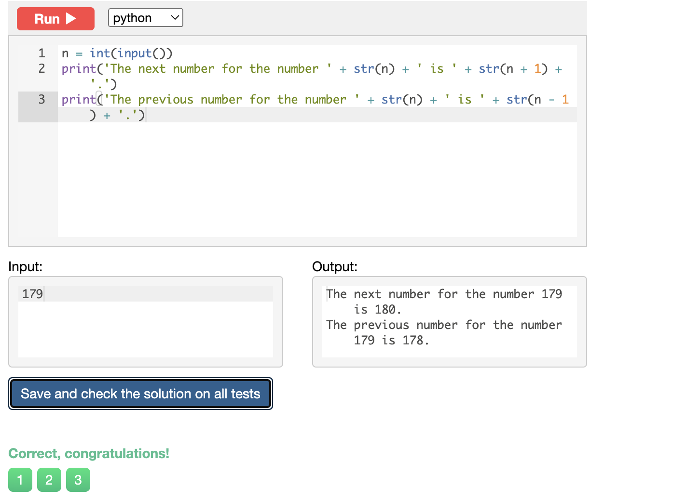
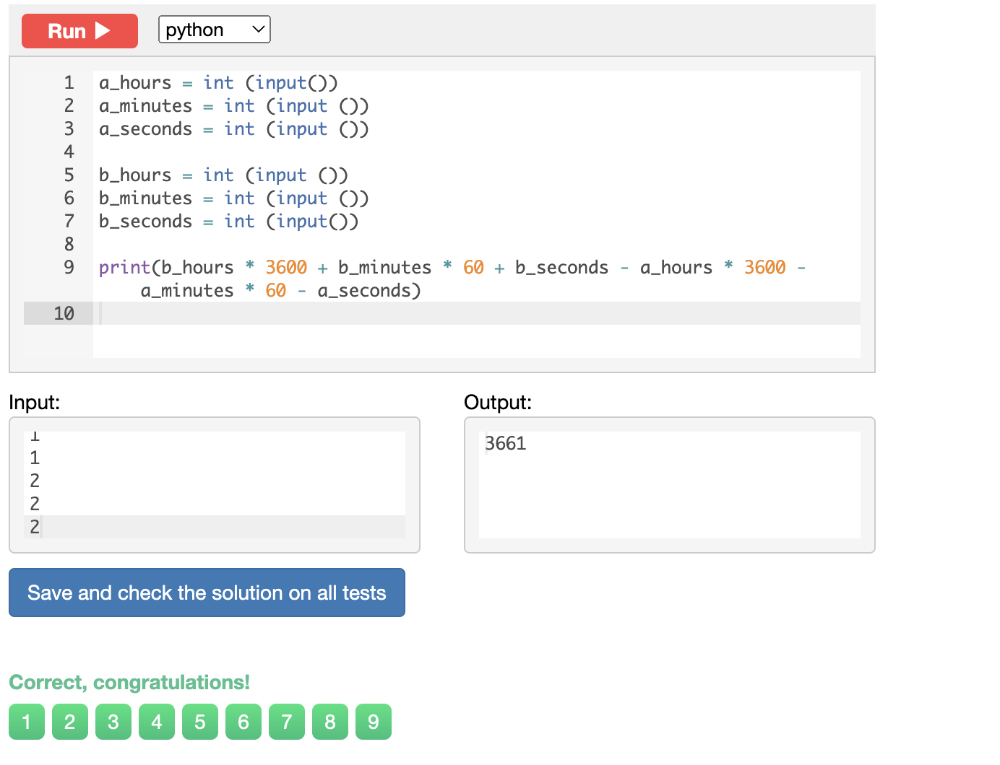
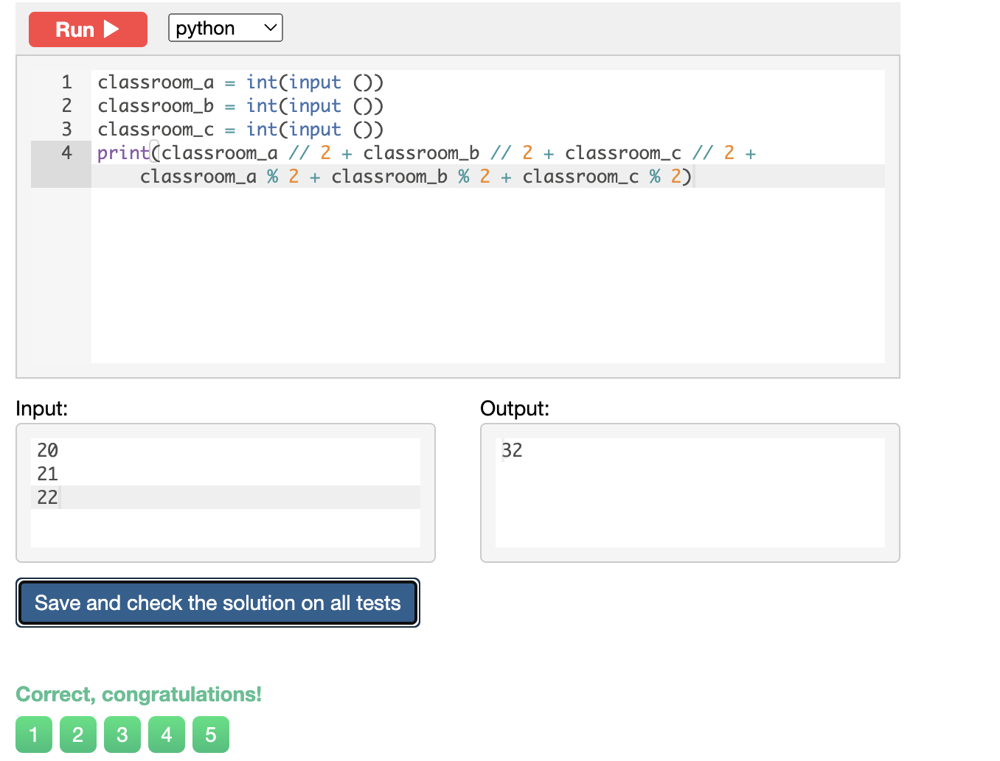

## Chapter 1 ##
Sum of three numbers
```.py
a = int(input())
b = int(input())
c = int (input())
print(a + b + c) 
```


Hi John
```.py
name = str(input())
print("Hi " + name)
```


Area of right angle triangle 
```.py
b = int(input())
h = int(input())
print (b * h / 2 )
```


Hello, Harry!
```.py
name = input()
print ("Hello, " + name + "!")
```


Apple sharing 
```.py
n = int(input())
k = int(input())
print (k//n) 
print (k%n)
```


Previous and next 
```.py
n = int(input())
print('The next number for the number ' + str(n) + ' is ' + str(n + 1) + '.')
print('The previous number for the number ' + str(n) + ' is ' + str(n - 1) + '.')
```


Two timestamps 
```.py
a_hours = int (input())
a_minutes = int (input ())
a_seconds = int (input ())

b_hours = int (input ())
b_minutes = int (input ())
b_seconds = int (input())

print(b_hours * 3600 + b_minutes * 60 + b_seconds - a_hours * 3600 - a_minutes * 60 - a_seconds)
```


School desks
```.py
classroom_a = int(input ()) 
classroom_b = int(input ()) 
classroom_c = int(input ())
print(classroom_a // 2 + classroom_b // 2 + classroom_c // 2 + classroom_a % 2 + classroom_b % 2 + classroom_c % 2)
```

